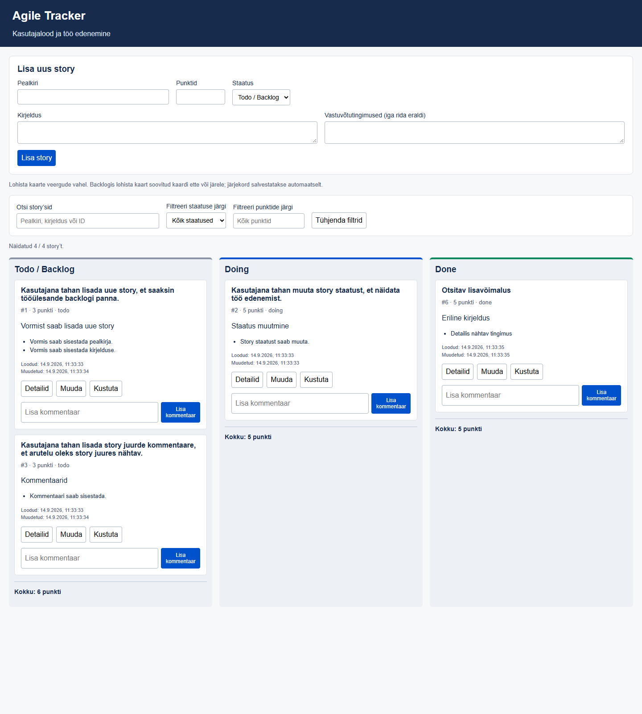
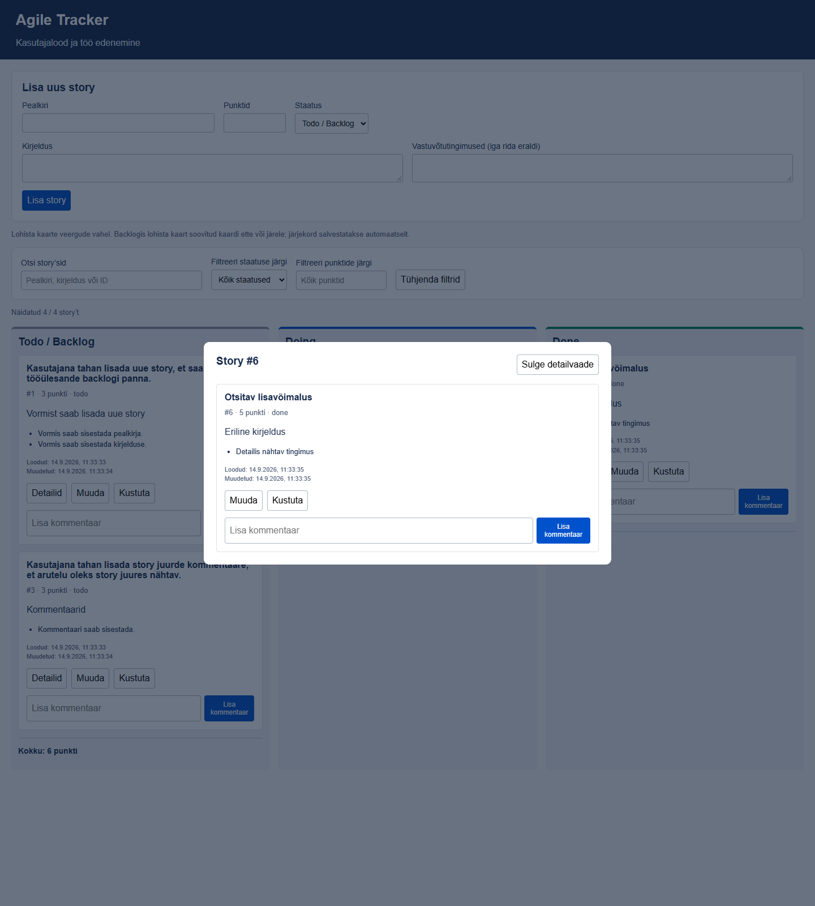

# Agile Tracker

Veebirakendus kasutajalugude haldamiseks kolmes Kanban-veerus: **Todo / Backlog**, **Doing** ja **Done**.

## 1. Kasutatud tehnoloogiad

- Node.js ja Express: veebiserver ning REST API.
- HTML, CSS ja JavaScript: kasutajaliides, muutmisvorm ja hiirega lohistamine.
- JSON-fail `data/stories.json`: püsiv andmesalvestus.
- Node.js test runner: API automaattestid.
- Playwright: kasutajaliidese ja tegeliku hiirega lohistamise brauseritestid.

## 2. Käivitamine

Vaja on Node.js 22 või uuemat ning npm-i.

```sh
git clone https://github.com/vikk-tak25/ken-janek-agile-tracker.git
cd ken-janek-agile-tracker
npm ci
npm start
```

Ava **http://localhost:3000**. Esimene andmepäring loob automaatselt JSON-faili ja kolm näidisstory't. Andmed säilivad lehe värskendamisel ning serveri taaskäivitamisel. Andmefail on Gitist välja jäetud.

Windows PowerShellis võib kasutada `npm.cmd`, kui skriptide käivitamise poliitika blokeerib käsu `npm`.

Valikulised keskkonnamuutujad: `PORT` (vaikimisi 3000) ja `DATA_DIR` (vaikimisi projekti `data` kataloog). Testid kasutavad eraldi ajutist andmekataloogi, mitte kasutaja andmeid.

## 3. Valmis funktsioonid

- Story lisamine, muutmine ja kustutamine veebilehel ning REST API kaudu.
- Kolm Kanban-veergu ja story staatuse muutmine vormis või veergude vahel lohistades.
- Backlogi kaartide lohistamine soovitud kohale ja järjekorra salvestamine.
- Unikaalne ID, pealkiri, kirjeldus, staatus, punktid ja vastuvõtutingimused.
- Punktid on mittenegatiivsed täisarvud; tühi, murdarvuline või muu vigane sisend annab veateate.
- Vähemalt üks mittetühi vastuvõtutingimus; iga tingimus eraldi real.
- Kommentaaride lisamine ja kuvamine koos lisamise ajaga.
- Sisendi kontroll ka serveris; vigased andmed ei kirjuta olemasolevaid andmeid üle.
- Kasutaja sisestatud tekst kuvatakse tekstina, mitte HTML-ina.
- API ja brauseritestid ning väikesele ekraanile kohanduv paigutus.

### Kasutamine

Täida ülemine vorm ja vajuta **Lisa story**. Kaardi **Muuda** nupp täidab sama vormi olemasolevate andmetega; seejärel vajuta **Salvesta muudatused** või **Loobu muutmisest**.

Haara kaart selle ülaosast. Backlogis vii see teise kaardi ülemise poole kohale, et asetada see kaardi ette, või alumise poole kohale, et asetada see järele. Teise veergu lohistamine muudab staatust. Järjekorra püsivust saab kontrollida lehte värskendades. Puuteekraanil saab staatust muuta muutmisvormiga.

## 4. Lisavõimalused ja piirangud

Kõik juhendis loetletud lisavõimalused on teostatud:

- Eraldi story detailvaade nupuga **Detailid**; sulgemine nupuga või Escape-klahviga.
- Otsing pealkirja, kirjelduse ja ID järgi, sõltumata suur- ja väiketähtedest.
- Kombineeritavad staatuse ja täpse punktiarvu filtrid ning filtrite tühjendamine.
- Punktide summa iga veeru all. Filtritega näidatakse eraldi nähtavate ja kõigi veeru story'de summat.
- Story loomise ja viimase muutmise aeg nii kaardil kui detailvaates.
- Kommentaaride kustutamine kinnitusega nii kaardil kui detailvaates.
- Lohistamine kõigi veergude vahel, sobivad HTTP veakoodid ja automaattestid.
- Väikesele ekraanile kohanduv kujundus.

Filtrite või otsingu kasutamisel on lohistamine välja lülitatud, et peidetud kaartide järjekord ei muutuks kogemata. Staatust saab sel ajal muuta muutmisvormiga. Filtrite tühjendamine taastab lohistamise.

Vanade story'de tegelikku loomise aega ei saa tagantjärele tuvastada: puuduv kuupäev salvestatakse väärtusega `null` ja kuvatakse „Teadmata (varasem story)”. Uutel story'del ja uue andmefaili näidisandmetel salvestatakse ajatemplid automaatselt. Muutmise aeg uueneb story muutmisel, staatuse või prioriteedi muutmisel ning kommentaari lisamisel või kustutamisel; loomise aeg säilib.

Kohustuslikke funktsioone ega juhendi lisavõimalusi pooleli ei ole. Varasema arenduse töökorraldust ei saa tagantjärele tõendada. Rakendus on lihtne ühe kasutaja õppeprojekt: paralleelne mitme serveriprotsessi kirjutamine samasse JSON-faili ei ole toetatud.

## 5. Kõige keerulisemad kohad

- Lohistamisel tuleb muuta kaartide tegelikku järjekorda enne ID-de serverisse saatmist. Varem saadeti serverisse vana järjekord.
- Veeru muutmine ja backlogi järjestamine on kaks eraldi API toimingut. Vea korral loetakse laud uuesti serverist, et kuvada tegelikult salvestatud seis.
- `parseInt` lubas varem vigase sisendi nagu `1.5` või `3abc` osaliselt arvuks teisendada. Nüüd kontrollitakse tervet sisendit ja server valideerib JSON-arvu eraldi.
- Testide andmed tuleb hoida kasutaja andmetest eraldi ning kontrollida säilimist ka serveri taaskäivitamise järel.

## REST API

Päringukehadel kasuta päist `Content-Type: application/json`.

| Meetod ja aadress | Kirjeldus | Edukood |
|---|---|---|
| `GET /api/stories` | Kõik story'd prioriteedi järjekorras | 200 |
| `GET /api/stories/:id` | Üks story | 200 |
| `POST /api/stories` | Uue story loomine | 201 |
| `PUT /api/stories/:id` | Story muutmine | 200 |
| `DELETE /api/stories/:id` | Story kustutamine | 204 |
| `PATCH /api/stories/:id/status` | Staatuse muutmine, nt `{"status":"doing"}` | 200 |
| `PATCH /api/stories/reorder` | Backlogi täielik uus järjekord, nt `{"order":[3,1]}` | 200 |
| `POST /api/stories/:id/comments` | Kommentaari lisamine, nt `{"text":"Kontrollitud"}` | 201 |
| `DELETE /api/stories/:id/comments/:commentId` | Kommentaari kustutamine; puuduv kommentaar annab 404 | 204 |

Story loomise ja muutmise keha:

```json
{
  "title": "Kasutajana tahan lisada story",
  "description": "Story ilmub backlogi.",
  "status": "todo",
  "points": 3,
  "acceptanceCriteria": ["Pealkiri on kaardil nähtav."]
}
```

`PUT` vajab pealkirja, punkte ja vastuvõtutingimusi; puuduv kirjeldus muutub tühjaks. Puuduv staatus säilitab muutmisel eelmise staatuse ja loomisel annab staatuse `todo`. Server määrab ID ja kommentaari ajatembli ise. Kommentaarid säilivad story muutmisel.

`reorder` peab sisaldama kõiki parajasti backlogis olevaid ID-sid täpselt üks kord. Teiste veergude, korduvad või tundmatud ID-d lükatakse tagasi. Uus backlogi story paigutatakse vaikimisi lõppu.

Vigade vastused: `400` vigane sisend, `404` puuduv story või API aadress, `413` liiga suur päring, `500` serveri või salvestamise viga. Vastus sisaldab `error` teksti või `errors` tekstide massiivi.

## Testimine

```sh
npm test
npx playwright install chromium
npm run test:ui
```

API testid kontrollivad CRUD-i, kommentaare, valideerimist, staatust, täieliku backlogi järjekorda ja andmete säilimist serveri taaskäivitamisel. Brauseritest kontrollib lisamist, muutmist, vigaseid punkte, kommentaare, hiirega lohistamist mõlemas suunas, lehe värskendamist, veeruvahetust ja kustutamist.

Lisatestid kontrollivad kuupäevade säilimist, vanade andmete uuendamist, kommentaaride kustutamist, otsingu ja filtrite kombineerimist, punktisummasid ning detailvaadet.

Juba paigaldatud Microsoft Edge'i kasutamiseks PowerShellis:

```powershell
$env:PLAYWRIGHT_CHANNEL = 'msedge'
npm.cmd run test:ui
```

## Ekraanipilt





## GitHubi töökorraldus

Iga edasine funktsioon või parandus tuleb siduda GitHubi issue'ga. Loo enne selle arendamist eraldi haru, mille nimi algab tegeliku issue ID-ga (näiteks `12-backlogi-jarjestamine`). Tee väikesed sisulised commit'id ja pushi iga commit kohe. Hoia issue's kirjas vastuvõtutingimused ning lisa pull request'ile testimise tulemus.

Varasemat ajalugu ei kirjutata ümber. Tagantjärele loodud issue'd ja harud ei tõenda varasema arenduse töökorraldust.
